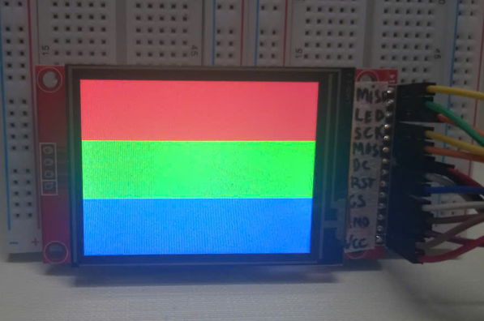

# 🖥️ STM32F407 + ILI9341 2.4" LCD (SPI) Communication

This project demonstrates how to communicate with a 2.4" TFT LCD using the **ILI9341 controller** via **SPI interface** on the **STM32F407** microcontroller.

It's built for **learning purposes**, focusing on how SPI communication works and how to interface with graphical displays at a low level.

---

## 🖼️ LCD Specs

- **Size**: 2.4 inches
- **Resolution**: 240x320
- **Driver IC**: ILI9341
- **Interface**: 4-wire SPI
- **Supply Voltage**: 5V

---
## Wiring Table  (hw_def.h)
| LCD Pin      | STM32F407 Pin | Description           |
| ------------ | ------------- | --------------------- |
| **VCC**      | 5V            | Power Supply          |
| **GND**      | GND           | Ground                |
| **CS**       | PB9           | Chip Select           |
| **RESX**     | PD10          | Reset (Active Low)    |
| **DCX**      | PD9           | Data/Command Select   |
| **SDI/MOSI** | PB15          | SPI MOSI (SPI2)       |
| **SDO/MISO** | PC2           | SPI MISO (optional)   |
| **SCK**      | PB13          | SPI Clock (SPI2)      |
| **LED**      | 5V            | Backlight (Always On) |

---

## 🔄 Features (Current)

✅ LCD Initialization  
✅ Send command and data via SPI  
✅ Add function to fill background with colors

---

### 📘 Lessons Learned

Throughout this project, I encountered several interesting challenges and gained valuable insights into working with STM32 and SPI-based LCDs. Here are some of the key lessons learned:

---

#### 🐛 HAL SPI Issues at Low Clock Speeds

Initially, I used the internal **HSI (16 MHz)** with SPI configured at **1–2 MHz**. Although the logic analyzer showed that all SPI commands were sent correctly using the STM32 HAL API, the LCD did not initialize or display properly.

To debug this, I modified `lcd_send_command()` and `lcd_send_data()` to use **register-level access** instead of HAL functions — and this **worked** with SPI at 1–2 MHz.

Then I realized that the **low SPI speed** might be the root cause of the issue. So I switched the system clock source to **PLL at 168 MHz**, and surprisingly, the **HAL SPI API** started working as expected.

---

#### ❓ Unable to Read Data from LCD (e.g., ID, Status)

I attempted to read data from the LCD (e.g., display **ID** and **status registers**), but failed to get valid responses.  
I'm still unsure whether this is due to:

- Hardware limitations of the LCD module, or  
- Issues in my **SPI read implementation**

Further investigation is required.

---

#### 🔧 16-bit Write with HAL API Unclear

In the `lcd_write()` function, I needed to send **16-bit data** to the LCD.

However, I couldn't get `HAL_SPI_Transmit()` to work properly with **16-bit transfers** using a `uint8_t *` buffer. As a result, I had to fall back to **direct register-level SPI access** to manually transmit the data.

This part still needs improvement, or at least a clearer understanding of how to configure **HAL SPI** to transmit 16-bit values using an 8-bit buffer.

---

#### ✅ Flexible API Switching

These challenges led me to introduce the `USE_STM32_API` ann `USE_HSI_16MHZ` macro, which allows easy switching between:

- **STM32 HAL API**  
- **Bare-metal register access**
- **HSI 16Mz or using pll 168MHz**

### Using functions `ili9341_test_draw_color_bars()`

### Happy learning !!!!

